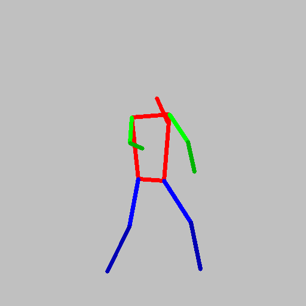

# Motion Generation using UNet and Denoising Diffusion Probablity Model
 

- Motion Generation using State of the Art Generative AI technique called Denoising Diffusion Probability Model (DDPM). 
- This repository uses the [denoising_diffusion_pytorch](https://github.com/lucidrains/denoising-diffusion-pytorch/tree/main) Python Package.

### How to use this code

- Use the sampler.py file to create training images in `dataset/images.npy` sampled from `data/uptown_funk.json`

. The sampler uses parameters N, WINDOW, save_path, data_path and seed to set the number of images, the size of each image, the save path, data path and the random_seed of the dataset sample. 
- The get_meta_data() function is used to get the scaler information for data sample.
- Use the main.py file to train UNet model. The model hyperparameters can be set in the train_Unet_DDPM() functions.
- Once the model is trained, motion samples can be generated by using the sample_Unet_DDPM() function by specifying the model_path, output_path, image size and batch size.

### Sample Generated Motion

### References
- The project follows [SinMDM](https://sinmdm.github.io/SinMDM-page/) paper from ICLR 2024.
